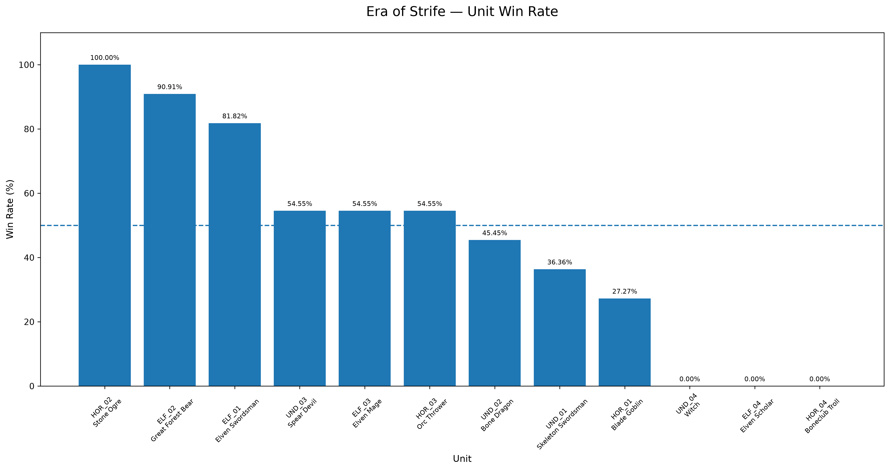
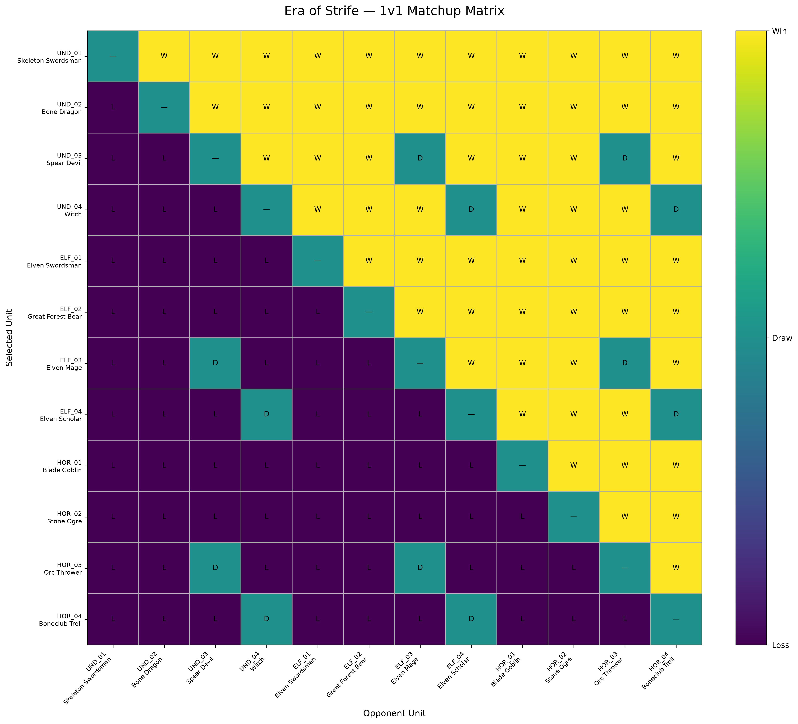
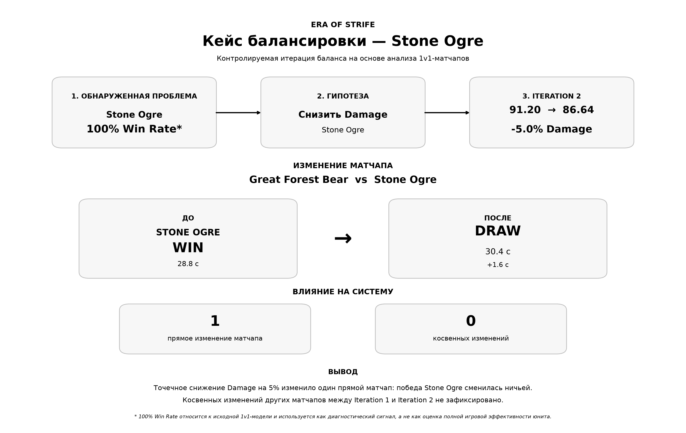

# Era of Strife — баланс и META-анализ мобильной RTS

**Era of Strife** — портфолио-проект по системному дизайну и игровому балансу для концепта мобильной RTS.

В проекте я спроектировал систему из трёх асимметричных фракций и 12 юнитов, формализовал игровые параметры в данных, разработал на Python воспроизводимую модель 1v1-боя и использовал её для диагностики баланса, проверки гипотез и контролируемых итераций.

**Основной процесс работы:**

**игровой дизайн → данные → проверка → моделирование → диагностика → гипотеза → изменение → повторная симуляция → анализ влияния → вывод**

---

## Проект в цифрах

| Показатель | Значение |
|---|---:|
| Фракции | 3 |
| Юниты | 12 |
| Боевые роли | 4 |
| Способности | 12 |
| Уникальные 1v1-матчапы | 66 |
| Основной балансировочный кейс | Stone Ogre |
| Язык анализа | Python |

> **Важно:** 1v1-модель используется как диагностический инструмент. Цель анализа — находить крайние и пограничные случаи и проверять влияние отдельных параметров, а не приводить каждый юнит к 50% Win Rate независимо от его роли.

---

## Игровая система

В основе **Era of Strife** лежат три фракции с различной игровой идентичностью.

### Undead

Фракция построена вокруг постепенного истощения противника, ослабления и сохранения собственной боеспособности.

- **Skeleton Swordsman** — Infantry
- **Bone Dragon** — Tank
- **Spear Devil** — Ranged
- **Witch** — Support

### Forest & Dark Elves

Фракция ориентирована на точечные взаимодействия, мобильность, позиционирование и высокую ценность отдельных юнитов.

- **Elven Swordsman** — Infantry
- **Great Forest Bear** — Tank
- **Elven Mage** — Ranged
- **Elven Scholar** — Support

### Horde

Фракция делает акцент на прямом силовом давлении, высокой живучести и сильном ближнем бою.

- **Blade Goblin** — Infantry
- **Stone Ogre** — Tank
- **Orc Thrower** — Ranged
- **Boneclub Troll** — Support

Для всех 12 юнитов разработаны индивидуальные способности и определены роль, назначение, сильные и слабые стороны.

Подробное описание игровой системы и способностей:

[`docs/01_game_design.md`](docs/01_game_design.md)

---

## Аналитический процесс

### 1. Подготовка и проверка данных

Характеристики юнитов, способности, риски баланса и тестовые сценарии были вынесены в структурированные CSV-данные.

Перед моделированием выполняется автоматическая проверка:

- идентификаторов;
- обязательных ролей;
- числовых значений;
- диапазонов параметров;
- связей между юнитами и способностями.

Исходные данные отделены от экспериментальных результатов, поэтому балансировочные итерации не перезаписывают первоначальное состояние системы.

---

### 2. Моделирование боя

Для диагностики реализована детерминированная модель 1v1-боя.

Она учитывает:

- `HP`;
- `Damage`;
- `Attack Interval`;
- независимое время атак;
- возможность одновременной атаки;
- победу, поражение или ничью;
- продолжительность боя.

Для 12 юнитов анализируются:

**C(12, 2) = 66 уникальных матчапов.**

Один и тот же `combat_engine.py` используется для исходного и изменённого состояния, поэтому при сравнении итераций меняются только намеренно выбранные параметры.

---

### 3. Диагностика исходного состояния

Первичный анализ включает:

- статистику побед, поражений и ничьих;
- Win Rate;
- Combat Score;
- продолжительность боёв;
- матрицу матчапов;
- поиск крайних и пограничных результатов.

#### Win Rate



Высокий или низкий Win Rate рассматривается не как автоматическое доказательство проблемы, а как сигнал для дальнейшего анализа с учётом роли юнита и конкретных матчапов.

#### Матрица матчапов



Матрица позволяет увидеть структуру сильных и слабых взаимодействий между всеми 12 юнитами и определить кандидатов для более детального исследования.

---

## Ключевой кейс: Stone Ogre

Основным балансировочным кейсом проекта стал **Stone Ogre** — Tank фракции Horde.

Первоначальная диагностика показала крайне высокий результат Stone Ogre в упрощённой 1v1-модели.

При этом задача заключалась не в том, чтобы механически приблизить его Win Rate к 50%, а в том, чтобы проверить:

> можно ли уменьшить наступательное давление Stone Ogre, сохранив его высокую живучесть и роль тяжёлого Tank?

Поэтому `HP` намеренно не изменялся. Основным параметром для эксперимента был выбран `Damage`.

---

### Итерация 1

Первое контролируемое изменение:

| Параметр | До | После | Изменение |
|---|---:|---:|---:|
| Damage | 96,00 | 91,20 | -5% |
| DPS | 60,00 | 57,00 | -5% |

После первой итерации дополнительно были выполнены:

- повторный анализ матчапов;
- проверка воспроизводимости;
- диагностика происхождения данных;
- анализ прямого и косвенного влияния;
- анализ чувствительности Stone Ogre;
- уточнение пороговых значений.

---

### Итерация 2

На основании результатов была сформулирована следующая гипотеза:

> дополнительное небольшое снижение Damage должно уменьшить наступательное давление Stone Ogre, не изменяя его роль Tank.

Изменялся только `Damage`.

| Параметр | До | После | Изменение |
|---|---:|---:|---:|
| Damage | 91,20 | 86,64 | -5% |
| DPS | 57,00 | 54,15 | -5% |
| HP | 1760 | 1760 | 0% |

Суммарное изменение Damage после двух итераций:

**96,00 → 91,20 → 86,64**

Два последовательных уменьшения на 5% дают:

**0,95 × 0,95 = 0,9025**

То есть итоговое снижение относительно исходного значения составило **9,75%**.

---

## Результат балансировочного эксперимента



Во второй итерации изменение одного параметра Stone Ogre привело к изменению результата **одного непосредственно связанного матчапа**:

**Great Forest Bear vs Stone Ogre**

| | До | После |
|---|---|---|
| Результат | победа Stone Ogre | ничья |
| Время боя | 28,8 с | 30,4 с |

Изменение времени боя:

**+1,6 с**

При этом:

- прямых изменившихся матчапов — **1**;
- косвенно изменившихся матчапов — **0**;
- `HP` Stone Ogre сохранился на уровне **1760**;
- роль Tank не изменялась.

Полученный результат поддерживает проверяемую гипотезу: снижение `Damage` уменьшило наступательное давление Stone Ogre в модели, не затрагивая его базовую живучесть.

Изменение рассматривается как **перспективный вариант для дальнейшей проверки**, а не как окончательный производственный баланс.

---

## Почему я не продолжил автоматически ослаблять Stone Ogre

После второй итерации дальнейшее уменьшение характеристик только из-за высокого общего показателя не является целью анализа.

1v1-модель намеренно ограничена и не воспроизводит полноценный RTS-бой.

Поэтому следующий логичный этап — увеличивать глубину модели и проверять роль Stone Ogre в более широком игровом контексте, а не механически стремиться к 50% Win Rate.

---

## Проверка воспроизводимости

Поскольку модель детерминирована, отдельно проверялась стабильность результатов.

Было выполнено:

- **5 повторных запусков**;
- **66 матчапов в каждом запуске**;
- **330 проверенных результатов**.

Результат:

| Показатель | Значение |
|---|---:|
| Нестабильные матчапы | 0 |
| Изменённые строки | 0 |
| Изменённые поля | 0 |
| Статус | Reproducible |

При этом воспроизводимость рассматривается отдельно от корректности модели: детерминированный расчёт может стабильно воспроизводить и ошибку.

Поэтому в проекте дополнительно проверяются логика вычислений, происхождение данных и целостность исходных файлов.

---

## Контроль исходных данных

Балансировочные эксперименты не изменяют исходный:

`data/unit_balance.csv`

Для него выполняется проверка SHA-256.

Экспериментальные состояния и результаты сохраняются отдельно от исходных данных, что позволяет сравнивать итерации без потери первоначального состояния системы.

---

## Ограничения модели

Текущая 1v1-модель — диагностическая, а не производственная симуляция полноценного RTS-боя.

Она пока не моделирует в полном объёме:

- способности юнитов;
- `Attack Range`;
- `Move Speed`;
- позиционирование;
- pathfinding;
- групповые сражения;
- фокус целей;
- командные синергии;
- стоимость юнитов;
- экономику;
- состав армии;
- карту;
- действия и skill игрока.

Поэтому результаты проекта интерпретируются как **контролируемые эксперименты**, а не как прогноз реального PvP-баланса.

---

## Структура проекта

```text
era-of-strife-meta-balance/
│
├── data/
│   ├── unit_balance.csv
│   ├── ability_balance.csv
│   ├── balance_risks.csv
│   ├── interaction_matrix.csv
│   ├── balance_tests.csv
│   └── combat_scenarios.csv
│
├── analysis/
│   ├── 01_validate_data.py
│   ├── 02_explore_balance.py
│   ├── 03_analyze_abilities.py
│   ├── 04_run_balance_tests.py
│   ├── 05_combat_simulation.py
│   ├── 06_analyze_matchups.py
│   ├── 07_visualize_matchups.py
│   ├── 08_balance_recommendations.py
│   ├── 09_balance_iteration.py
│   ├── ...
│   ├── 12_portfolio_visualization.py
│   ├── ...
│   ├── 20_iteration_comparison.py
│   ├── combat_engine.py
│   └── results/
│
├── docs/
│   ├── 01_game_design.md
│   ├── 02_balance_methodology.md
│   ├── 03_balance_iterations.md
│   └── 04_final_findings.md
│
├── README.md
├── requirements.txt
└── .gitignore
```

---

## Документация

Подробная информация вынесена из README в отдельные документы:

- [`01_game_design.md`](docs/01_game_design.md) — фракции, юниты, способности и игровая система;
- [`02_balance_methodology.md`](docs/02_balance_methodology.md) — методология анализа и моделирования;
- [`03_balance_iterations.md`](docs/03_balance_iterations.md) — балансировочные итерации и сравнение результатов;
- [`04_final_findings.md`](docs/04_final_findings.md) — итоговые выводы и ограничения.

---

## Инструменты

Проект выполнен с использованием:

- **Python**
- **pandas**
- **NumPy**
- **Matplotlib**
- **CSV**
- **Git / GitHub**

---

## Запуск проекта

Установка зависимостей:

```bash
pip install -r requirements.txt
```

Пример запуска анализа:

```bash
python analysis/01_validate_data.py
python analysis/05_combat_simulation.py
python analysis/06_analyze_matchups.py
```

Создание портфолио-визуализации Stone Ogre:

```bash
python analysis/12_portfolio_visualization.py
```

---

## Дальнейшее развитие

Следующий этап развития модели может включать:

- полноценную обработку способностей;
- моделирование дальности и перемещения;
- стоимость и экономическую эффективность юнитов;
- групповые сражения;
- составы армий;
- командные синергии;
- различные сценарии боя;
- сравнение результатов симуляции с пользовательской телеметрией при наличии реальных игровых данных.

---

## Итог

**Era of Strife** демонстрирует полный цикл работы с задачей игрового баланса:

**проектирование системы → формализация данных → моделирование → диагностика → формирование гипотезы → контролируемое изменение → повторное тестирование → анализ влияния → вывод.**

Главный результат проекта — не попытка получить «идеальные» показатели для каждого юнита, а построение **понятного, проверяемого и воспроизводимого процесса принятия решений по игровому балансу**.